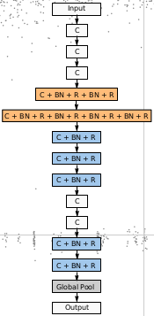

### Dependences
pytorch, scikit-learn

### Steps

1. Copy 2 files to {TORCHVISON_PATH}/models.
```cp {__init__.py,simple.py} {TORCHVISON_PATH}/models```.

2. Run.
```python main.py -a evolution {CIFAR10_DATA_DIR}```

cf. How to know {TORCHVISON_PATH}?
```
import torchvision
print(torchvision.__file__)
```

### Note
Numbers of channels are not in the paper. It is set by me.

### Original Paper
https://arxiv.org/abs/1703.01041 (Google Brain)


